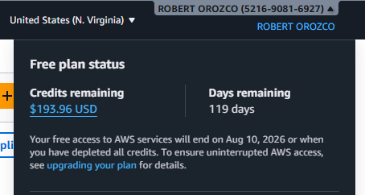
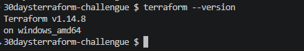
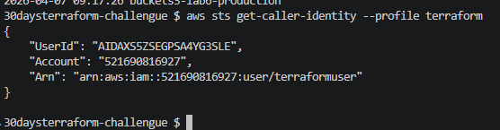

# Día 1 de Terraform

## Tarea 1: Libro - Terraform: Up & Running by Yevgeniy Brikman — Chapter 1

Lee el capítulo 1 del libro mencionado anteriormente. Lee con intención enfocandote en qué es terraform y para que se utiliza.

## Tarea 2: Configura tu ambiente.

- **CUENTA DE AWS** - Primero debes configurar tu cuenta de AWS. El free tier es suficiente.

- **TERRAFORM** - Instala la última versión de terraform localmente en tu computador.

- **AWS CLI** - Configura tus credenciales en AWS CLI de forma local.

- **VISUAL STUDIO CODE** - Instala VS Code y añade la extensión de Hashicorp Terraform.

## Tarea 3: MI BLOG

**¿QUÉ ES LA INFRAESTRUCTURA COMO CÓDIGO? ¿CÓMO ESTÁ TRANSFORMANDO DEVOPS?**

**What IaC is and the problem it solves**
La IaC es infraestructura con código, elimina configuraciones manuales y errores, logrando entornos reproducibles.

**Declarative vs Imperative**
Declarative define el estado final; Terraform decide cómo lograrlo. Imperative indica paso a paso cómo crear recursos.

**Why Terraform is worth learning**
Terraform permite automatizar infraestructura multi-cloud de forma consistente, escalable y versionada.

**Personal goals (30-day challenge)**
Dominar Terraform, crear módulos reutilizables y aplicar buenas prácticas para diseñar infraestructura profesional