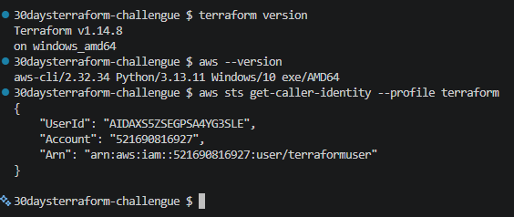

# Día 2 de Terraform

## Tarea 1: Validación de tu ambiente.

**AWS Account** — Create one if you do not have it. Enable MFA on your root account immediately. Set up a billing alert so you are not surprised by charges.

**IAM User** — Create a dedicated IAM user for Terraform with programmatic access. Do not use your root account credentials.

**Terraform** — Install the latest version. Run terraform version to confirm.

**AWS CLI** — Install and run aws configure with your IAM user credentials. Set your default region.

**Visual Studio Code** — Install the HashiCorp Terraform extension and the AWS Toolkit plugin.

**Full Validation** — Run all four commands below and confirm clean output:

