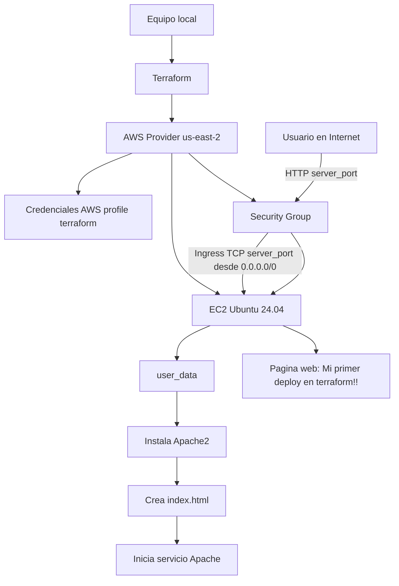

# Día 3 de Terraform

## Tarea: Desplegar tu primer servidor con terraform

**Book:** Terraform: Up & Running by Yevgeniy Brikman — Chapter 2

**Read the following sections specifically:**

Deploying a Single Server
Deploying a Web Server

**FLUJO DE CREACIÓN**

```text
Tu equipo local
   │
   ▼
Terraform
   │
   ▼
AWS Provider (us-east-2, profile terraform)
   ├── Crea Security Group
   │      ├── Ingress: TCP server_port desde 0.0.0.0/0
   │      └── Egress: todo permitido
   │
   └── Crea EC2 Ubuntu 24.04
          ├── Asocia Security Group
          ├── Ejecuta user_data
          │      ├── apt update
          │      ├── instala apache2
          │      ├── crea index.html
          │      └── inicia apache2
          │
          └── Publica la pagina web
```
Terraform se autentica en AWS usando el perfil local terraform y despliega una instancia EC2 en us-east-2. La instancia se asocia a un Security Group que permite tráfico entrante al puerto definido en server_port. Durante el arranque, user_data instala Apache, crea una página HTML personalizada e inicia el servicio web.

