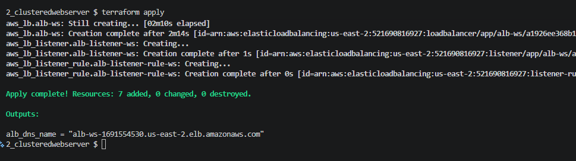
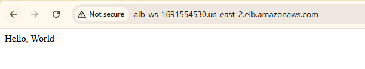

## Tarea: DRY: Don't Repeat Yourself

**Book:** Terraform: Up & Running by Yevgeniy Brikman — Chapter 2

Read pages 60 through 69. Focus on:
    How input variables eliminate hardcoded values
    How to make infrastructure configurable without changing core logic
    The DRY principle as it applies to Terraform configurations
    How a clustered setup differs architecturally from a single server

**FIRST CLUSTERED WEB SERVER**

Primero creo un grupo de seguridad con el nombre **tf-sg** 

```hcl
resource "aws_security_group" "tf-sg" {
  name = "tf-sg"
  ingress {
    from_port = var.server_port
    to_port = var.server_port
    protocol = "tcp"
    cidr_blocks = ["0.0.0.0/0"]
  }

    egress {
    from_port   = 0
    to_port     = 0
    protocol    = "-1"
    cidr_blocks = ["0.0.0.0/0"]
  }
}
```

Luego, creo un launch template con el nombre **tf-ws-template**

Importante invocar correctamente el id del sg (tf-sg)
create_before_destroy : Primero crea el recurso nuevo, luego elimina el viejo.

```hcl
resource "aws_launch_template" "tf-ws-template" {
    name = "tf-ws-template"
    image_id = "ami-0fb653ca2d3203ac1" 
    instance_type = var.instance_type
    
    vpc_security_group_ids = [aws_security_group.tf-sg.id]
    
      user_data = base64encode(<<-EOF
                                #!/bin/bash
                                echo "Hello, World" > index.html
                                nohup busybox httpd -f -p ${var.server_port} &
                                EOF
                                )
    lifecycle {
        create_before_destroy = true
    }

    tag_specifications {
    resource_type = "instance"

    tags = {
      Name = "tf-webserver"
      Env  = "lab"
    }
  }
}
```

Luego, creamos el austocaling group. Aquí se invoca al tf-aws-template anterior.

```hcl
resource "aws_autoscaling_group" "tf-asg-ws" {
    name = "tf-asg-ws"
    max_size = 10
    min_size = 2
    desired_capacity = 2
    launch_template {
    id      = aws_launch_template.tf-ws-template.id
    version = "$Latest"
    }   
    vpc_zone_identifier = data.aws_subnets.default.ids
    
    target_group_arns = [aws_lb_target_group.asg.arn]
    health_check_type = "ELB"

    tag {
        key = "Name"
        value = "tf-webserver"
        propagate_at_launch = true
    }
}
```

***RESULTS***



