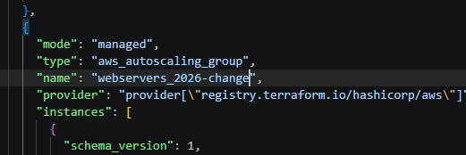
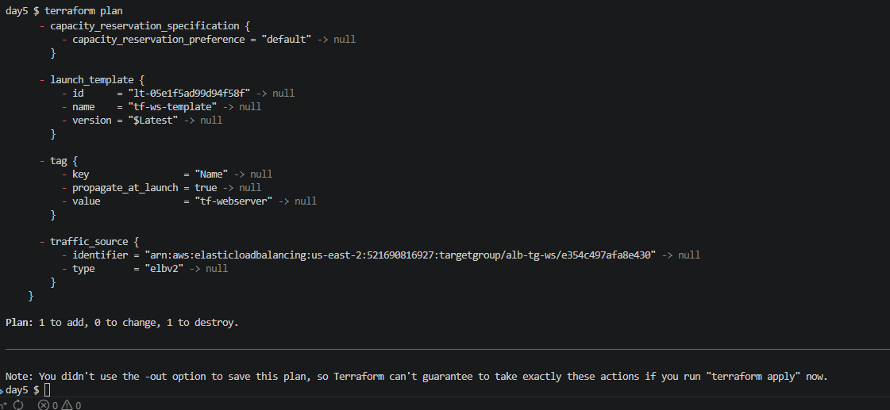
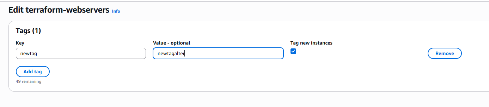
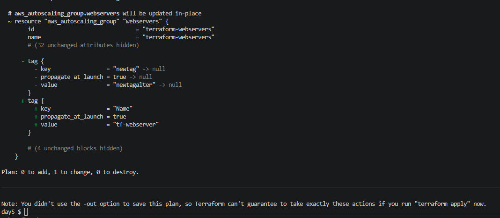

## Tarea: DRY: Don't Repeat Yourself

**Book:** Terraform: Up & Running by Yevgeniy Brikman
Finish Chapter 2 and begin Chapter 3. Focus on these sections:
Deploying a Load Balancer
What is Terraform State
Shared Storage for State Files
Limitations with Terraform State

**EXPLORE AND UNDERSTAND THE STATE FILE**

Experiment 1 — Manual state tampering: Manually edit a value in terraform.tfstate (change an instance type or a tag value). Run terraform plan and observe what Terraform detects. Then restore the original value.

¿Qué sucede si modificamos una variable en terraform.tfstate?

Modifique el parámetro del nombre en el ASG.

El error fue este:

Luego vuelves al valor original y no detecta cambios.

CONCLUSION

El archivo terraform.tfstate no debe ser modificado manualmente, ya que es crítico para la gestión del estado y puede provocar inconsistencias o comportamientos inesperados en la infraestructura.

Experiment 2 — State drift: In the AWS Console, manually change a tag on one of your EC2 instances. Run terraform plan without touching your code. Observe how Terraform detects the drift and what it proposes to do about it.

Altero el tag existente en el ASG mediante la consola web.

Hago nuevamente terraform plan a ver si detecta el cambio.

CONCLUSION

Terraform detecta automáticamente el “drift” entre la infraestructura real y el estado almacenado, y propone acciones para reconciliar los cambios y mantener la consistencia declarativa.

Terraform mantiene la infraestructura basada en un modelo declarativo, donde el archivo de estado (terraform.tfstate) actúa como referencia. Cualquier modificación manual, ya sea en el state o en la infraestructura real, puede generar inconsistencias que Terraform intentará reconciliar mediante un plan y apply.

**TERRAFORM BLOCK COMPARISON TABLE**

| Block Type | Purpose | When to Use | Example |
|-----------|---------|-------------|---------|
| provider | Configures the cloud provider | Once per provider | provider "aws" { region = "us-east-1" } |
| resource | Configures un recurso del provider | En cada componente | provider "aws" "aws_instance" "web" { ... } |
| variable | Declares an input variable | To avoid hardcoding values | variable "instance_type" { default = "t2.micro" } |
| output | Exposes values after apply | To surface IPs, DNS names, IDs | output "alb_dns" { value = aws_lb.example.dns_name } |
| data | Reads existing resources | To reference things not managed by this config | data "aws_availability_zones" "all" {} |

Cover the full ALB setup, how it integrates with your ASG, and what the state file is doing behind the scenes. Include your block comparison table. A second angle you can take: Best Practices for Managing Terraform State Files — cover why you should never commit state to Git, what remote backends are, and why state locking matter