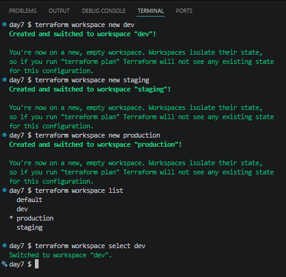
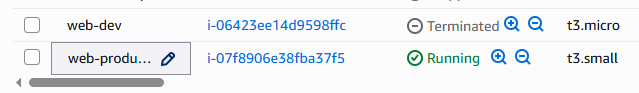
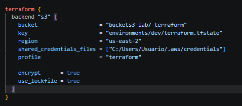
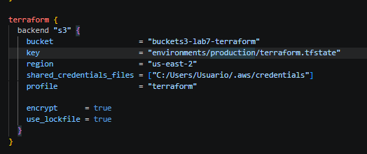
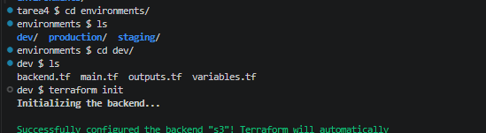

# 📅 DAY 7

## 📚 Book: Terraform: Up & Running by Yevgeniy Brikman — Chapter 3, pages 81–113

En esta seccion se habla de las buenas practicas para aislar entornos. Ejemplo.

Entorno DEV: dev.tfstate
Entorno PRODUCCION: prod.tfstate
Entorno STAGE: stage.tfstate

Es importante entender el aislamiento porque terraform compara código contrate state y contra infraestructura real.
Si mezclas estados puedes modificar recursos equivocados.
Puedes afectar otros entornos.


EL AISLAMIENTO se puede hacer de dos formas.

1. VIA WORKSPACES
2. VIA FILE LAYOUTS

COMANDOS IMPORTANTE
```hcl
terraform workspace show
terraform workspace list
terraform workspace new dev
terraform workspace select prod
```
Los workspaces son utiles en entornos pequeños.

Con FILE LAYOUTS separas fisicamente:

directorios
configuraciones
states

Cada entorno tiene su propio codigo, backend y state.

Esto de brinda una separaciòn real. Ejecutas terraform por separado, mantienes backends por separado y tienes states separados.


## 📚 TAREA 2: Practica: Isolation via workspaces.

Ejecuta los siguientes comandos para crear los workspaces y selecionar dev.



## 📚 TAREA 3: Practica: Crea un recurso en cada workspace.



## 📚 TAREA 4: Practica: Aislamiento por File Layouts

En esta tarea 4 usa la configuracion que usaste en el dia 6 y copialo a cada ambiente de trabajo.

En DEV configura asi:



En PRODUCTION configura asi:



Luego ejecuta init, plan y apply en cada ambiente independiente.

Ejecución en el ambiente DEV




